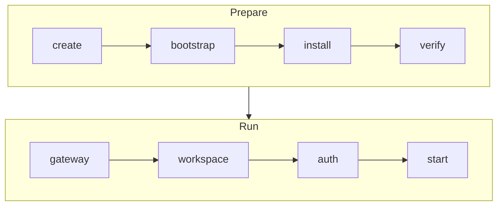

# Taxiway


Taxiway creates isolated labs for running and comparing agent orchestrators. A
lab lines up the runtime, credentials, workspace checkout, tools, observability, and
recordings before an orchestrator starts delivery work.

Use Taxiway when you want to answer practical questions about agent systems:

- Can this orchestrator complete real delivery work end-to-end?
- What happens when it plans, uses tools, gets stuck, or recovers?
- Which setup choices change behavior: runtime, credentials, tools, observability, or
  orchestrator profile?

## Requirements

| Requirement | Used for |
|---|---|
| `docker` on `PATH` and a reachable Docker daemon | Taxiway proxy, LiteLLM sidecars, optional observability, and Docker-backed labs |
| `limactl` on `PATH` | Lima-backed labs |

See [Drivers](docs/README.md#drivers),
[Gateway](docs/how-to/gateway.md), and
[Observability](docs/how-to/observability.md) for details.

## Installation

Install the latest GitHub Release:

```bash
curl -fsSL https://github.com/taxiway-sh/taxiway/releases/latest/download/install.sh | sh
```

The installer writes the `taxiway` binary to `$HOME/.local/bin` by default and
runtime assets to `~/.taxiway/runtime`.

Install a specific release:

```bash
curl -fsSL https://github.com/taxiway-sh/taxiway/releases/download/v0.1.0/install.sh | sh
```

Install to another binary directory:

```bash
curl -fsSL https://github.com/taxiway-sh/taxiway/releases/latest/download/install.sh | sh -s -- --bin-dir /usr/local/bin
```

## Quick Start

```bash
taxiway init
taxiway up mylab --type <type> --repo https://github.com/org/repo
taxiway shell mylab
```

Use `codex`, `claude-code`, or `gastown` as `<type>`. See
[docs/README.md#orchestrators](docs/README.md#orchestrators) for setup and
authentication notes.

`taxiway init` checks Docker, starts the shared Taxiway proxy, and starts the
optional Langfuse observability stack. `taxiway up` creates the lab and starts
the gateway path automatically when the selected orchestrator needs it.

The two host-local paths are separate:

- **Gateway:** per-lab LiteLLM sidecar and route at
  `http://<lab>.litellm.localhost:<proxy-port>`.
- **Observability:** optional Langfuse trace storage at
  `http://langfuse.localhost:<proxy-port>`.

## Core Commands

| Command | Description |
|---|---|
| `taxiway up <lab> [--type <orch>]` | Prepare and start a lab |
| `taxiway shell <lab>` | Attach to the lab shell or orchestrator session |
| `taxiway shell <lab> --check` | Verify that the lab session target is ready |
| `taxiway list [<lab>]` | List labs or show one lab |
| `taxiway init` | Initialize the Taxiway runtime |
| `taxiway status` | Show global runtime status |
| `taxiway access` | Show service URLs and credentials |
| `taxiway repair` | Repair generated runtime state |
| `taxiway destroy` | Destroy the local Taxiway runtime |
| `taxiway credentials codex` | Prepare global Codex auth for LiteLLM |
| `taxiway record` | Manage lab recordings |
| `taxiway observe` | Manage optional local Langfuse observability |
| `taxiway describe <orchestrator>` | Inspect an orchestrator adapter |

See [docs/reference/commands.md](docs/reference/commands.md) for the complete
command reference.

## Concepts

A lab is an isolated environment where an orchestrator runs. Each lab has a name
and an orchestrator type. `taxiway up` runs idempotent phases:



Supported orchestrator adapters are documented in
[docs/README.md#orchestrators](docs/README.md#orchestrators). See
[docs/reference/concepts.md](docs/reference/concepts.md) for the full lab model.

## Gateway And Observability

Taxiway generates the lab LiteLLM gateway environment during `taxiway up`.
Gateway state, API keys, and LiteLLM config are lab-specific. Start or refresh a
gateway explicitly with:

```bash
taxiway gateway <lab>
```

The optional observability stack is global to the runtime. Start it when you
want Langfuse traces:

```bash
taxiway observe up
taxiway observe open
```

See [Gateway](docs/how-to/gateway.md),
[Observability](docs/how-to/observability.md), and
[Configuration](docs/reference/configuration.md) for details.

## Documentation

Start with [docs/README.md](docs/README.md). The public documentation covers:

- [Concepts](docs/reference/concepts.md)
- [Commands](docs/reference/commands.md)
- [Orchestrators](docs/README.md#orchestrators)
- [Drivers](docs/README.md#drivers)
- [Configuration](docs/reference/configuration.md)
- [Gateway](docs/how-to/gateway.md)
- [Observability](docs/how-to/observability.md)
- [Recordings](docs/how-to/recordings.md)
- [Architecture](docs/reference/architecture.md)
- [Development](docs/contributing/development.md)

## Development

Local development requires [Go](https://go.dev/doc/install). The repository
includes a versioned `.envrc` for source-checkout development:

```bash
source .envrc
go build -o ./taxiway ./cmd/taxiway
./taxiway version
```

Run unit tests:

```bash
make test-unit
```

Create a local GoReleaser snapshot:

```bash
make snapshot
```

See [docs/contributing/development.md](docs/contributing/development.md) for the
contributor workflow and [docs/contributing/testing.md](docs/contributing/testing.md)
for the test split.

## License

Taxiway is released under the [MIT License](LICENSE).
