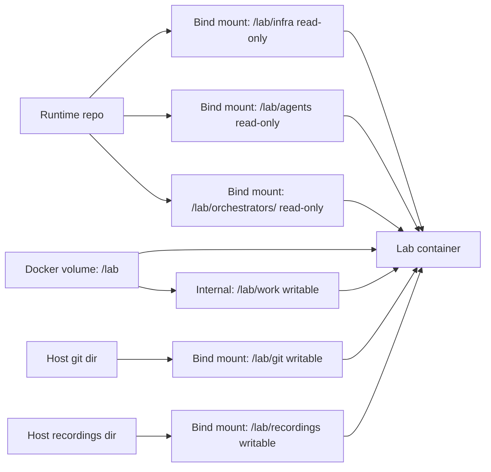

# Docker

The Docker driver creates one long-running container per lab. It is useful for
Linux development, CI, and fast end-to-end coverage without requiring Lima.

## Requirements

- `docker` on `PATH`.
- Docker daemon reachable through `docker info`.
- Bind mounts visible in detached containers.
- The `ubuntu:24.04` image available locally, or network access for the first
  pull.

Known working storage drivers include `overlay2` and `btrfs`. Docker-in-Docker
setups using `vfs` can break bind-mount visibility; Docker-backed end-to-end
tests skip this case instead of failing.

## Lab Layout



The driver:

- creates a named Docker volume for `/lab`;
- starts a container with a Taxiway-owned non-root `taxiway` user for lab
  commands;
- installs `sudo`;
- installs a no-op `systemctl` shim for scripts that expect systemd;
- bind-mounts runtime assets read-only at `/lab/infra`, `/lab/agents`, and
  `/lab/orchestrators/<type>`;
- keeps `/lab/work` as internal writable lab state inside the Docker volume;
- bind-mounts the host bare Git remotes directory at `/lab/git`;
- bind-mounts the host recordings directory at `/lab/recordings`.

This matches the Lima driver contract: runtime assets are read-only, while
`/lab/git` and `/lab/recordings` are host-visible writable per-lab state
directories under `.lab-state/<lab>/`. `/lab/work` is writable but remains
internal to the lab for stronger isolation.

The default image is `ubuntu:24.04`. It follows the tag so lab containers pick
up upstream image patch updates when Docker pulls the image.

Manual pull:

```bash
docker pull ubuntu:24.04
```

Docker driver test coverage (unit tests and the end-to-end suite) is documented
in [Testing](../contributing/testing.md).

## Troubleshooting

### `failed to mount overlay`

This usually means the host cannot use `overlay2`, often because Docker is
running inside an unprivileged container. Use a standard Linux host, Docker
Desktop, or a GitHub Actions `ubuntu-latest` runner.

### Orphan Containers

Taxiway registers cleanup on exit, but a hard crash can leave containers behind:

```bash
docker ps -a | grep "taxiway-e2e-" | awk '{print $1}' | xargs docker rm -f
```

The matching volumes are named `taxiway-<container>-lab`.
