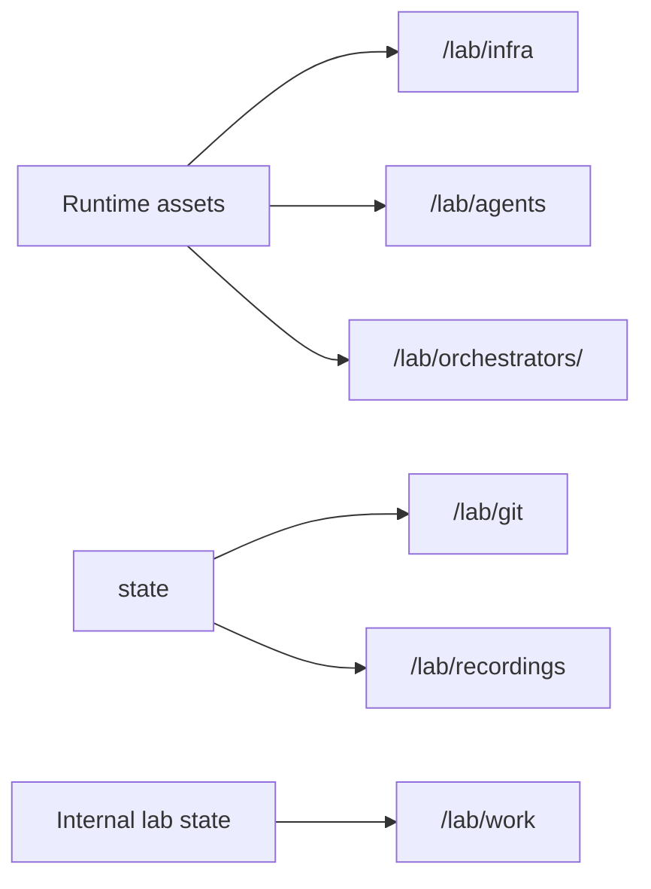

# Lima

The Lima driver creates one Lima-backed lab per Taxiway lab. It is the preferred
local driver when `limactl` is available.

## Requirements

- `limactl` on `PATH`.
- A host that can run Lima instances.

Taxiway auto-selects Lima before Docker when both are available.

The shared gateway is not part of the Lima VM. It runs on the host through
Docker and provides Caddy plus per-lab LiteLLM sidecars. Langfuse observability
also runs on the host through Docker when started with `taxiway observe up`.

## Template

The driver renders a Lima VM template into the lab state directory before
running:

```bash
limactl start --name=<id> <rendered-yaml>
```

The rendered YAML is kept with the lab state for debugging.

## Mounts



The template mounts only the runtime assets needed inside the lab:

- `/lab/infra`
- `/lab/agents`
- `/lab/orchestrators/<type>`
- `/lab/git`
- `/lab/recordings`

`/lab/work` is created inside the lab and is not host-mounted. Workspace
working trees live there, while `/lab/git` remains the host-visible bare remote
mount and `/lab/recordings` remains the host-visible recordings mount.

The template intentionally does not define a top-level Lima `users:` block, so
Lima keeps its default host-user mapping.

## Commands

The driver shells out to `limactl` for lifecycle, copy, shell, and exec
operations.
