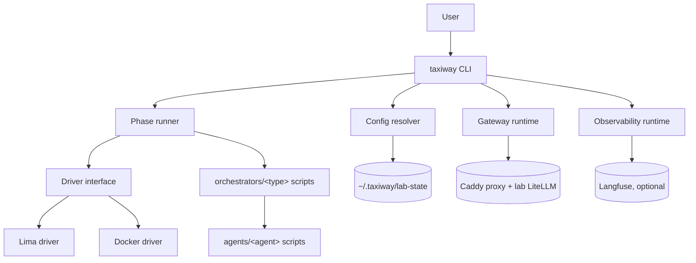
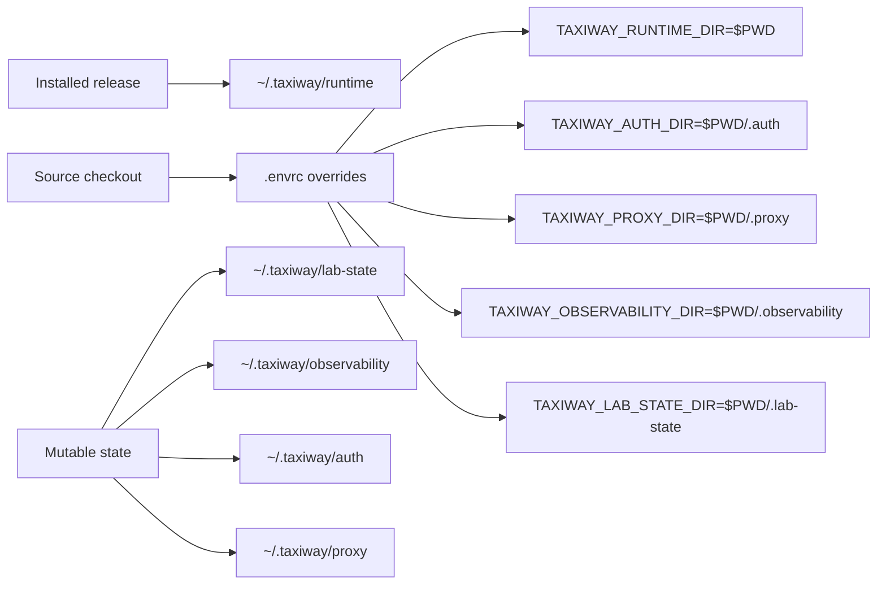
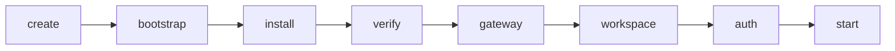
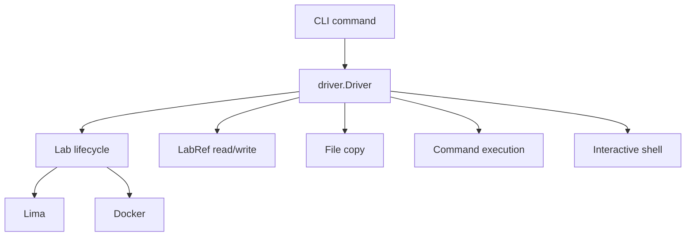
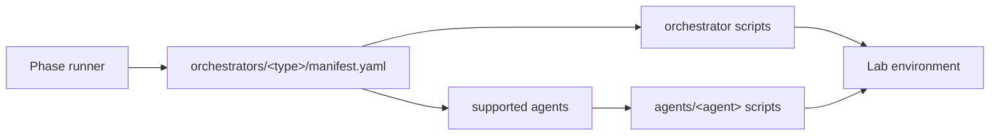
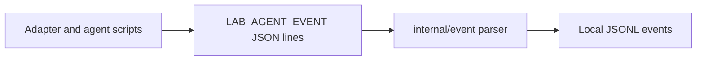

# Architecture

Taxiway is a CLI-first lab runner. Its core job is to turn a requested lab into
a reproducible environment by selecting a driver, persisting lab metadata,
executing lifecycle phases, and delegating orchestrator-specific behavior to
adapter scripts.

## System Overview



The Go CLI owns command parsing, phase ordering, state paths, driver selection,
event parsing, and user-facing output. Drivers own the mechanics of creating
and operating labs. Orchestrator and agent scripts own tool-specific setup
inside the lab.

## Main Components

| Component | Responsibility |
|---|---|
| `cmd/taxiway` | CLI entry point |
| `internal/cli` | Cobra commands, global flags, lifecycle orchestration |
| `internal/config` | Runtime paths, state paths, lab metadata, orchestrator validation |
| `internal/phases` | Canonical phase names, ordering, and phase marker files |
| `internal/driver` | Driver interface shared by Lima, Docker, and dry-run execution |
| `internal/event` | `LAB_AGENT_EVENT` parsing and formatting |
| `internal/cli/proxy.go` | Shared Caddy proxy runtime, route registry, and generated Caddyfile |
| `internal/cli/lab_gateway.go` | Per-lab LiteLLM sidecar, Postgres, route, and gateway environment generation |
| `orchestrators/<type>` | Adapter scripts for install, verify, workspace, auth, start, doctor |
| `agents/<agent>` | Agent CLI install, verify, auth, and doctor scripts |
| `infra/` | Runtime assets copied or mounted into labs |

## Runtime Assets and User State

Taxiway separates immutable runtime assets from mutable user state.



Release installs use `~/.taxiway/runtime` for runtime assets.
Source-checkout development sets checkout-local runtime state through `.envrc`.

## Lab Metadata

Each lab has a persisted `ref.json` file under the lab state directory. It is
the source of truth for resuming commands without repeating command-line flags.

```json
{
  "version": 5,
  "lab": "mylab",
  "orch": "codex",
  "driver": "lima",
  "workspace": {
    "repo": "https://github.com/org/repo",
    "ref": "main",
    "path": "subdir"
  },
  "orchestrator_profile": {
    "name": "default"
  },
  "settings": {
    "version": "latest"
  }
}
```

The lab name determines the environment name, usually `taxiway-<lab>`. The
orchestrator type is stored separately so commands such as
`taxiway run <lab>` can resume the correct adapter without another `--type`
flag.

## Phase Execution

`taxiway up` is a phase runner. Each phase has a marker file under the lab state
directory. Completed markers let Taxiway resume interrupted work without
rerunning finished phases.



| Phase | Owner | Purpose |
|---|---|---|
| `create` | Driver | Create the lab environment and write `ref.json` |
| `bootstrap` | Infra command | Install system dependencies |
| `install` | Orchestrator and agents | Install adapter-specific tools |
| `verify` | Orchestrator and agents | Verify installed tools without doing real work |
| `gateway` | CLI + driver | Reconcile generated LiteLLM/proxy access and write lab gateway env |
| `workspace` | Orchestrator adapter | Prepare the workspace repository |
| `auth` | Agent scripts | Run interactive authentication when needed |
| `start` | Orchestrator adapter | Start runtime sessions |

## Driver Boundary

All lab operations go through `internal/driver.Driver`. CLI commands do not call
`limactl`, `docker`, or shell commands directly for lifecycle operations.



This boundary keeps lifecycle commands independent from the underlying driver
implementation. Lima and Docker can differ internally while exposing the same
lifecycle, copy, exec, and shell methods to the CLI.

Driver-specific runtime behavior is documented in [Drivers](../README.md#drivers).

## Adapter Boundary

Orchestrator adapters live under `orchestrators/<type>/`. Agent installers live
under `agents/<agent>/`. The adapter manifest declares which agents are
currently supported by that adapter.



Taxiway owns the lab lifecycle and calls the adapter at known phase boundaries.
The adapter owns the details of installing, verifying, configuring, and starting
the specific orchestrator.

## Events and Observability

Adapter and agent scripts can emit `LAB_AGENT_EVENT {json}` lines. The driver
execution path parses those lines and writes structured events to a local JSONL
file for lab debugging.



Langfuse traces come from LiteLLM model traffic, not from Taxiway's internal
phase events.

## Extension Points

| Extension | Files to add or change |
|---|---|
| New orchestrator adapter | `orchestrators/<type>/manifest.yaml` and phase scripts |
| New supported agent CLI | `agents/<agent>/install.sh`, `verify.sh`, `auth.sh`, `doctor.sh` |
| New driver | Implementation of `internal/driver.Driver` and driver selection wiring |
| New phase behavior | `internal/phases`, corresponding CLI command, and driver/adapter calls |
| New local event sink | `internal/event` and driver execution wiring |

The preferred extension path is to add narrow adapters or drivers behind
existing interfaces rather than expanding the CLI command surface first.
