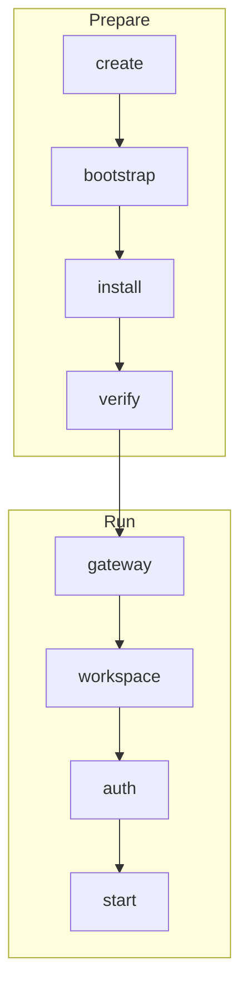

# Concepts

Taxiway creates isolated labs for agent orchestrators. A lab is a disposable,
repeatable environment that contains the tools, workspace, and runtime
sessions an orchestrator needs before it starts working.

## Labs

A lab has:

- a name, such as `mylab`;
- an orchestrator type, such as `claude-code`, `codex`, or `gastown`;
- a driver, currently `lima` or `docker`;
- host-side state under the Taxiway state directory;
- runtime sessions inside the lab environment.

Lab names are used to derive lab identifiers. The default prefix is
`taxiway-`, so `mylab` becomes `taxiway-mylab`.

## Drivers

Taxiway can create labs with either Lima or Docker.

| Driver | Use case |
|---|---|
| `lima` | Lima-backed local labs on macOS and Linux |
| `docker` | Container-backed local labs and Docker-backed end-to-end coverage |

By default, Taxiway auto-selects a driver. Use `--driver <name>` to force one.
See [Drivers](../README.md#drivers) for backend-specific behavior.

The gateway is a separate host service. It uses Docker for the shared Caddy
proxy and per-lab LiteLLM sidecars regardless of the selected lab driver. Lab
commands start gateway pieces automatically when an orchestrator needs them.
Langfuse observability is optional and starts separately with
`taxiway observe up`.

## Orchestrators

Each subdirectory of `orchestrators/` is a self-contained adapter. An adapter
declares how to install, verify, configure, and start one orchestrator.

See [Orchestrators](../README.md#orchestrators) for adapter-specific setup for
`claude-code`, `codex`, and `gastown`.

Use this command to inspect any adapter:

```bash
taxiway describe <type>
```

## Phases

`taxiway up` runs two phase groups:



Prepare phases create the environment and install the orchestrator. Runtime
phases reconcile generated gateway access, prepare the workspace, run
interactive authentication, and start sessions. The gateway phase is responsible
for the lab LiteLLM sidecar and proxy route; it does not require Langfuse to be
running.

The shared Taxiway proxy is a runtime entry point. `taxiway init` starts the
proxy and Langfuse observability. Lab or observability `down`/`rm` commands
remove their routes without automatically stopping the proxy. If an initialized
proxy container is missing or stopped, `taxiway repair` starts it again. Use
`taxiway destroy` when you want to remove the whole local runtime.

Phases are idempotent. If a phase already completed, Taxiway records that state
and can resume from later phases.

## Workspace Repositories

Attach a repository when the orchestrator should work on real code:

```bash
taxiway up mylab --type <type> --repo https://github.com/org/repo
```

During the workspace phase, Taxiway mirrors the source repository into a
per-lab bare Git repository under the lab state directory. Orchestrator
workspace scripts then clone from that isolated local remote. The lab's
`origin` points at the lab-local remote, not at the source repository, so
pushes stay inside the lab state unless an orchestrator explicitly reconfigures
remotes.

Useful options:

| Option | Description |
|---|---|
| `--repo-ref <branch|tag|sha>` | Checkout a specific ref |
| `--repo-path <subdir>` | Use a subdirectory as the working root |

## State

Installed releases keep runtime assets under:

```text
~/.taxiway/runtime
```

User state lives under:

```text
~/.taxiway/lab-state
~/.taxiway/auth
~/.taxiway/proxy
~/.taxiway/observability
```

Source-checkout development can override runtime and lab state with `.envrc`.
See [Development](../contributing/development.md).

## Recordings

Taxiway can record the same interactive session target used by
`taxiway shell <lab>`. Recordings are stored in the lab state `recordings`
directory and mounted into the lab at `/lab/recordings`.

Recording requires the target session to be running and `asciinema` plus
`tmux` to be available inside the lab runtime.

See [Recordings](../how-to/recordings.md) for the recording workflow.
